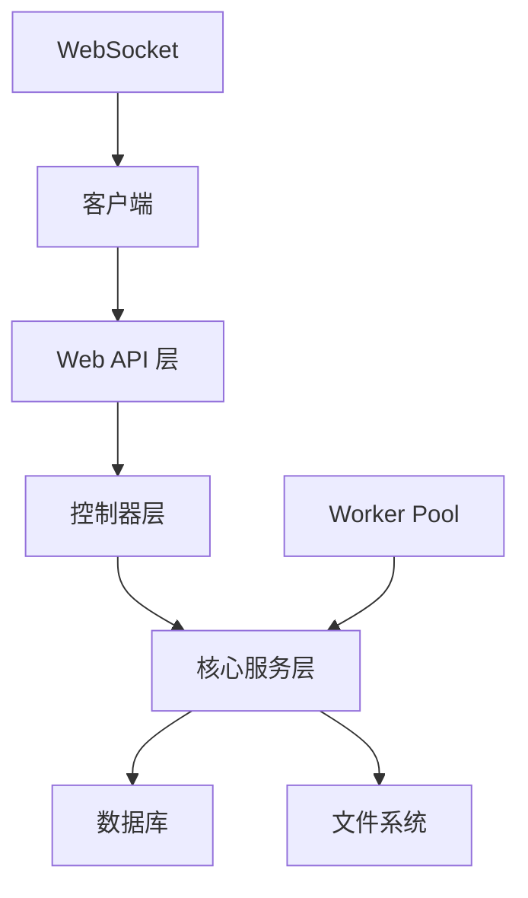

# EbookWorkshop-API

EbookWorkshop-API 是一个功能强大的电子书处理工具，提供 Web API 服务，支持多种电子书格式的采集和转换。

## 主要功能

- 电子书格式转换（支持 PDF、EPUB、TXT 等格式）
- Web API 接口服务
- 实时处理进度通知（WebSocket）
- 多线程任务处理
- 自动路由系统
- 系统配置管理

## 技术栈

- **运行环境**: Node.js
- **Web 框架**: Koa.js
- **数据库**: SQLite + Sequelize
- **API 文档**: Swagger
- **实时通信**: Socket.IO
- **图片处理**: Sharp
- **邮件服务**: Nodemailer
- **多线程**: Node.js Worker Threads

## 系统架构



## 目录结构

- `app.js` - 应用程序入口文件
- `config.js` - 系统配置文件
- `Controller/` - API 控制器和路由定义
- `Core/` - 核心功能模块
  - `Book/` - 电子书处理核心
  - `EPUB/` - EPUB 格式处理
  - `PDF/` - PDF 格式处理
  - `WebBook/` - Web 格式处理
  - `Worker/` - 工作线程池
  - `System.js` - 系统核心初始化
  - `EventManager.js` - 事件管理器
  - `Socket.js` - WebSocket 服务
- `Entity/` - 数据模型定义

## 核心特性

1. **模块化设计**
   - 采用模块化架构，各功能模块独立封装
   - 支持插件式扩展

2. **多线程处理**
   - 使用工作线程池处理耗时任务
   - 避免阻塞主线程

3. **实时进度通知**
   - 通过 WebSocket 推送处理进度
   - 支持任务状态实时更新

4. **自动路由系统**
   - 自动扫描并注册控制器
   - 支持多级路由嵌套

5. **统一错误处理**
   - 全局错误捕获
   - 标准化错误响应

## 初始化
```
npm install --registry=http://registry.npmmirror.com
```
若初始化出错看[初始化错误处理](#初始化错误处理)

## 运行
```
node app
```
前后端一起启动（需要在公共的父级目录执行）
```
wt --maximized -d %cd%\\EBWFrontEnd PowerShell -c npm run dev;split-pane -d %cd%\\EbookWorkshop node --inspect app
```
```bat
:: PowerShell 不能运行 npm 时
wt --maximized -d %cd%\\EBWFrontEnd cmd /K npm run dev;split-pane -d %cd%\\EbookWorkshop node --inspect app
```
>  --inspect 参数用于远程附加

## 系统配置

系统的主要配置在 `config.js` 文件中，包含以下关键配置项：

### 基础配置
```javascript
{
    // 书库-产物的存储目录（路径结尾不含斜线'/'）
    dataPath: "./../MyLibrary",

    // 数据库存放路径
    databasePath: "./../MyLibrary/Data/latest.sqlite",

    // 字体存放路径
    fontPath: "./../MyLibrary/font"
}
```

### 目录结构说明
- `dataPath`: 存储转换后的电子书文件
- `databasePath`: SQLite 数据库文件位置
- `fontPath`: 字体文件存储位置，用于电子书渲染

> 注意：所有路径都是相对于项目根目录的相对路径

### 调试配置
可以通过设置 `debug: true` 和配置 `debugSwitcher` 来开启特定模块的调试信息：

```javascript
{
    // 全局调试开关
    debug: false,

    // 调试开关配置
    debugSwitcher: {
        init: false,        // 模块装载情况
        database: false,    // 数据库调试
        workerPool: false, // 线程池调试
        email: false,      // 邮件服务调试
        puppeteer: false,  // 爬虫调试
        router: false,     // 路由调试
        pdf: false,        // PDF制作调试
        bookIndex: false,  // 书籍目录更新调试
        bookChapter: false,// 书籍章节更新调试
        saveBookCover: false // 书籍封面抓取调试
    }
}
```
## API 文档

启动服务后，访问 `http://localhost:8777/swagger` 查看完整的 API 文档。

## 相关文档
* 数据库查询    https://www.sequelize.cn/


## 初始化错误处理
### 报错关键字 PUPPETEER_SKIP_DOWNLOAD
具体出错格式类似：
>Failed to set up chrome vXXX.XXX.XXX! Set "PUPPETEER_SKIP_DOWNLOAD" env variable to skip download.
     
出现上述原因是因为安装 puppeteer 时，需要从google下载对应的浏览器版本，但下载的服务器地址访问不了（国内常见问题），这时可以①多试几次，②挂代理，或③手工下载并设置浏览器。
#### 手工下载并设置浏览器的方法
##### 首先，先完成安装 puppeteer
先检查目录 `./node_modules/puppeteer` 存在，里面有文件。如有，则可以跳过这步。
###### 用跳过下载的方式先安装 puppeteer
先设置运行变量跳过下载浏览器
```powershell
$env:PUPPETEER_SKIP_DOWNLOAD="true"
```
或
```bat
SET PUPPETEER_SKIP_DOWNLOAD=true
```
然后继续安装（npm i 或其他），正常情况这会安装完，用之前方法检查puppeteer文件夹是否已有内容。

##### 然后，手工下载设置浏览器
默认下载地址在`https://storage.googleapis.com/chrome-for-testing-public`，找个可用的镜像，比如：`https://registry.npmmirror.com/binary.html?path=chrome-for-testing/`。
* 在之前的报错格式里找到提示出错的版本，比如`chrome vXXX.XXX.XXX.XXX`。在打开的下载页面找到对应的浏览器、版本、平台，下载备用。
* 找到浏览器缓存的目录，一般是`C:\Users\当前用户登陆名\.cache\puppeteer\浏览器名\平台-版本号`。对应刚才的例子则是：`C:\Users\当前用户登陆名\.cache\puppeteer\chrome\win64-XXX.XXX.XXX.XXX`
* 将之前下载的浏览器文件解压到上述文件夹内，如刚才例子则是：`C:\Users\当前用户登陆名\.cache\puppeteer\chrome\win64-XXX.XXX.XXX.XXX\chrome-win64`，其中`chrome-win64`一般是压缩包的根文件夹。
* 确保chrome.exe在正确路径：`C:\Users\当前用户登陆名\.cache\puppeteer\chrome\win64-XXX.XXX.XXX.XXX\chrome-win64\chrome.exe`
* 到目录`./node_modules/puppeteer`中执行`node install.mjs`若不再出现其它版本报错，则完成了设置。（如果在之前设置环境变量的同一个对话框，还得先将变量设置回来`SET PUPPETEER_SKIP_DOWNLOAD=false`）不然会跳过下载。

运行项目，使用爬书相关的功能。无报错即可。

> 注：部分内容通过AI生成。